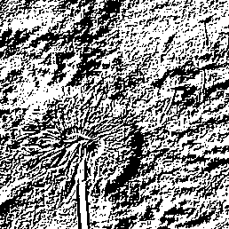

# README
## File
[Task*](): the file directory that contains necessary file for the project of each tasks.

[documentation.md](documentation.md): my procedure of doing ESHO2 project.

[picture](./picture/): directory that contains pictures needed for documentation.
## The dependency of this project
To avoid reinventing the wheel, the following tasks make use of some tools and Bluespec libraries developed by the students in ESA Group from Technical University of Darmstadt. 

Feel free to open Pull Requests or Issues if you have improvements or issues with these tools.
* https://github.com/esa-tu-darmstadt/BSVTools
* https://github.com/esa-tu-darmstadt/BlueAXI
* https://github.com/esa-tu-darmstadt/BlueLib

## Introduction of each task
* task1: realizing the Linux boot on board Avnet Ultra96V2
* task2: realizing the communication between the PS and PL with a simple personal IP(implementation of a multiplier and AXI Lite im my case)
* task3: developing a driver for IP on PL side
* task4: developing RGB2GRAY IP ,driver for it and realizing transaction between PS and PL
* task5: developing edge detection IP and driver for it and realizing transaction between PS and PL


## How to load binary file into firmware
Bin file for every task shoulde be stored in the `/lib/firmware` firstly. Just run the following command to load them
```
echo task*.bit > /sys/class/fpga_manager/fpga0/firmware
```
## Final result
### Original picture

### Conversion result of RGB2GEAY IP on PL side

### Conversion result  of edge detection IP on PL side

