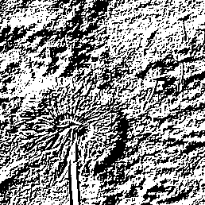

# ESHO2 procedure

## Task 1
### Building the linux kernel
* download X2GO and create a new session. 
* configure the session according to the X2GO Settings in Tutorial `esa-infra_2`
* setup the ‘PATH‘ variable of Vivado and Bluespec after logging into the server
* setup the ‘PATH‘ variable of CROSS_COMPILE toolchain for future compiling
add 
```
$ export XILINXD_LICENSE_FILE="/opt/cad/keys/xilinx"
$ source /opt/cad/xilinx/vitis/Vivado/<version>/settings64.sh
$ export PATH=$PATH:/opt/cad/bluespec/latest/bin
$ export PATH=$PATH:/opt/cad/xilinx/vitis/Vitis/2020.1/gnu/aarch64/lin/aarch64-linux/bin
```
to the file ~/.bashrc to modify the environment variable
* download the repository of Linux kernel from github
```
$ git clone https://github.com/Xilinx/linux-xlnx.git
```

* execute 
```
$ ARCH=arm64 CROSS_COMPILE=aarch64-linux-gnu- make xilinx_zynqmp_defconfig
```
create .config file
* review the .config file with command `make menuconfig`
referring the website https://en.wikipedia.org/wiki/Menuconfig
```
$ ARCH=arm64 CROSS_COMPILE=aarch64-linux-gnu- make menuconfig
```
I can see a configuration GUI. 
Type `/`, I can open a search bar. 
Type the  device name you want to configure. 
Type`Y` to select the configuration
Finally, save the configuration file with the name `.config`.
execute the multicore compilation
```
$ make -j ARCH=arm64 CROSS_COMPILE=aarch64-linux-gnu-
```
### Device Tree
* copy the content of device tree included file from the moodle to a new file named `Tapasco.dtsi`
* then include the `Tapasco.dtsi` in the file `avnet-ultra96-rev1.dts` in the same way as you would include the header file in C language
* run the following command to recompile the device tree source code
```
$ make ARCH=arm64 CROSS_COMPILE=aarch64-linux-gnu- dtbs
```

### partition of SD card
I use `dd` in Ubuntu.[<sup>1</sup>](#refer-anchor-1-1).
#### look up the partition
```
$ ls -ltr /dev | grep /i sd // look up the partition
```
#### remove the partition
```
$ sudo dd if=/dev/zero of=/dev/sda bs=1M count=16 //remove the partition
```
#### create new partitions
```
$sudo cfdisk /dev/sda
```
* 512M W95 Fat32(LBA) was set as **bootable**
LBA was used back in the days when you had disks bigger than 8GB. Without LBA, some BIOS could not address disks bigger than 8GB. 
* The rest was set as EXT4

>if it is a flash drive or external/internal hd with more than 4GB of space, use ext2/3 or NTFS
>If it's a flash drive that's 4GB or smaller, you'd want to format it in Windows with FAT32. Linux will recognize it by default.
>>difference: FAT 32 is for Win95 OSR2 Fat32 with a partition up to 2047Mb and Type c is for LBA-mapped capable of 2Tb size. The type b is for the early Win95 system and type c is for later Win95 and all Win98.

#### view all partitions that is created
```
$ cat /proc/partitions | grep sda
```
#### unmount all SD card partitions
```
$ umount /media/chris/1690-2A8F
```
I have not unmounted another partition because this partition failed to mount itself at the beginning, which were created by me initially with Diskgenius.
#### format the first partition "sda1" as FAT32
```
$ sudo mkfs.vfat -F 32 -n BOOT /dev/sda1
```
#### format the second partition "sda2" as EXT4
```
$ sudo mkfs.ext4 -L rootfs -E nodiscard /dev/sda2
```
### preparing Bootable SD Card
copy BOOT.BIN, Image, dtb to BOOT partition
```
$ cp BOOT.BIN /media/chris/BOOT/
$ cp Image /media/chris/BOOT/
$ cp avnet-ultra96-rev1.dtb /media/chris/BOOT/
```
Rename `avnet-ultra96-rev1.dtb` to `system.dtb`
Extract rootfs file to rootfs partition
```
$sudo tar -C /media/chris/rootfs -xf ArchLinuxARM-aarch64-latest.tar.gz
```
### First Boot
1. insert the SD card into the board
2. connect JTAG to the board
connect the board to Host computer using USB

Which serial port that the USB devices have used can be seen here
```
$ ls -l /dev/ttyUSB*
```
Firstly I need to give permission to USB, type
```
$ sudo chmod a+rw /dev/ttyUSB1
```
type the password
start picocom serial terminal
```
$ picocom -b 115200 /dev/ttyUSB1
```
if the terminal show "terminal ready", I can switch on the board. press **SW4** on the board.
Then Linux has been booted on our board.
### Design in vivado
* create new project
* create Block design named "system"
* add the MysteryRegs IP through Tools -> Create and package new IP  -> Package a specified directory. 
	* change nothing and click package IP
* click IP Catalog -> search Clocking Wizard -> customize IP 
	* set reset type to active low
	* click OK
* In the Diagram window, add IP "zynq UltraScale+ MPSoC", add IP "MysteryRegs" that I created just now
* add IP "clocking wizard" from the IP Catalog
* run connection automation
* Select Sources tab on top left corner of Block Design window. Right click on "system" and select Create HDL Wrapper. 
* run synthesis
* run implementation
* generate Bitstream
* export the Bitstream


### Setup and first program
#### loading bitstream during runtime
* Check that the configuration required by the FPGA manager is configured
* run the command to generate .bin from .bit file using Bootgen
```
$ bootgen -w -image full_bitstream.bif -arch zynqmp -process_bitstream bin
```
full_bitstream.bif file should contain the below lines:
```
all:
{
        output.bit /* Bitstream file name */
}
```
the file output.bit.bin is generated. 
* copy the file output.bit.bin into BOOT partition
* start up the Ultra96 board
* after the Linux is up, run the below commands to load the Bitstream
```
root@alarm:~# mount /dev/mmcblk0p1 /mnt/
root@alarm:~# mkdir -p /lib/firmware
root@alarm:~# echo 0 > /sys/class/fpga_manager/fpga0/flags
root@alarm:~# cp /mnt/output.bit.bin /lib/firmware/
root@alarm:~# echo output.bit.bin > /sys/class/fpga_manager/fpga0/firmware
[  1851.694027] fpga_manager fpga0: writing output.bit.bin to Xilinx ZynqMP FPGA Manager
```
After the bitstream is loaded successfully, blue LED on the board turns on.
#### maping the memory of IP core
* run the following command and uncomment the Server you want to use.
```
$ nano /etc/pacman.d/mirrorlist
```
* run the following instruction to install the GCC on Archlinux
```
$ pacman -S gcc
```
but the following errors prompted:
>error: db signature is unkown trust.
>File downloaded is corrupted(invalid or corrupted package (PGP Signature))

the cause is the pacman.conf shipped in pacman 5.1.0 now has package signing enabled by default. After upgrading to this version, if you haven't already enabled package signing and imported our signing keys you will need to do that before installing further packages.[<sup>6</sup>](#refer-anchor-1-6)

To initialize your pacman keyring and import the package signing keys:
```
$ pacman-key --init && pacman-key --populate archlinuxarm
```
Then rerun the commands to install gcc.
The Address editor showed in the Vivado is like following, which contains the paramters referenced in the mmap program.


* To map the memory of the IP core (see Vivado IP Integrator) into your system memory, I wrote the following program. run the following command can get detials of mmap.
```
$ man mmap
```
Because I need to read from and write to this Memory region, so `PROT_READ` and `PROT_WRITE` should be set. In addition, the updates to the mapping should be visible to other processes which also map this region.
```
#include <sys/mman.h>
#include <sys/stat.h>
#include <fcntl.h>
#include <stdio.h>
#include <stdlib.h>
#include <unistd.h>


#define handle_error(msg) \
   do { perror(msg); exit(EXIT_FAILURE); } while (0)

//define PAGESIZE 64*1024
#define PAGESIZE 20 // 20 is enough for this task
#define STARTADR 0x0080000000

int main(int argc, char *argv[]){
        char *addr;
        int fd = -1;

        fd = open(argv[1],O_RDWR);
        if(fd==-1)
                handle_error("open");
        addr = mmap(NULL, PAGESIZE, PROT_READ|PROT_WRITE, MAP_SHARED, fd, STARTADR);
        if(addr == MAP_FAILED)
                handle_error("mmap");


        munmap(addr, PAGESIZE);
        close(fd);
}

```
* After compilation, run the executable file to do the memory mapping.
```
$ ./myMmap output.bit.bin
```

### reference source 
<div id="refer-anchor-1-1"></div>

1. [Building Linux Kernel and Preparing bootable SD CARD for Beaglebone Board](https://youtu.be/l0746JYroOg)

2. [Generating Custom User IP Core in Vivado](https://youtu.be/I0eu_Y3pMmM)
3. [Create and package IP in Xilinx Vivado block design](https://youtu.be/ttRy2KC75nE)
4. [65 - Generating Different Clocks Using Vivado's Clocking Wizard](https://youtu.be/ngkpvMaNapA)
5. [Preparing a hardware design for ZYNQ Create a ZYNQ hardware project with custom IP](https://www.realdigital.org/doc/bb16275c20b8e11242bf729bba1439a3) 
<div id="refer-anchor-1-6"></div>

6. [Pacman 5.1.0 and Package Signing](https://archlinuxarm.org/forum/viewtopic.php?f=3&t=12797)


---
## Task2
### Creating the Bluespec project
1. Download the library required from github
```
$ git clone https://github.com/esa-tu-darmstadt/BSVTools
$ git clone https://github.com/esa-tu-darmstadt/BlueAXI
$ git clone https://github.com/esa-tu-darmstadt/BlueLib
```
2. Create the project using BSVTools with of the help of [README.md](../Blueproj/BSVTools/Readme.md). Run the following command in the directory Task_2.
```
../BSVTools/bsvNew.py Task2 --test_dir
```
### The sketch of my design
To having a more precise overview of my design, I made a sketch firstly. According to my understanding of the task requirements, the structure of my slave and testbench should be like this.


### Writing the my own Slave
The project file is stored in [Blueproj](./Task2/Blueproj).

The funtion to control handshake signals `rready`, `rvalid`. `wvalid`, `wready` has been already finished in the BlueAXI library and they will switch automatically during execution. Therefore, I pay more attention to the logical function of Multiplier and response of each request in my program. When compiling the IP, the interface of the module should not be polymorphic. So I defined the `addrwidth` as 40 (The address width of AXI Interconnect is also 40) and `datawidth` as 32 when constructing the module.

The interface name of AXI4_Lite_Slave_Rd_Fab and AXI4_Lite_Slave_Wr_Fab should be unified. So both have been defined as "axi_lite" through
```
interface AXI_Lite_Fab#(numeric type addrwidth, numeric type datawidth);
	(* prefix="axi_lite" *)
	interface AXI4_Lite_Slave_Rd_Fab#(addrwidth, datawidth) rd_fab;
	(* prefix="axi_lite" *)
    interface AXI4_Lite_Slave_Wr_Fab#(addrwidth, datawidth) wr_fab;
endinterface
```
In this way, the interface of ip core task2 is unified for the outside world.

I have many misunderstanding of value pass at the beginning, which leads to the failing in task3. After asking the tutor, get this answer
> The registers you define are just state elements that will be placed somewhere in your hardware. The order of declaration does not matter. What matters however is how you interface them with AXI. For your AXI interface (which consists of a read and write channel that are separate in the code), each request contains an address.

In the module of Task 2, I need to write like this
```
rule axi_dispatch;
let req <- axi_wr.request.get();

case(req.addr)
0: reg1 <= req.data;
4: reg2 <= req.data;
endcase

axi_wr.response.put(...);
endrule
```

### Creating the vivado project
* create the project like the Task1 
* select the add the Task2 IP through Tools -> Create and package new IP  -> Package a specified directory.
#### Adding system ILA
in this peripheral. the monitor type should be configured to `INTERFACE`. 
>`INTERFACE` is commonly used for debugging nets connected to interface pins (AXI_Interface). `NATIVE` can be used for debugging standard signals connected to non-interface pins (other customized connections). `MIX` can be used for debugging both standard pins or interface pins.

### Some SSH and SCP commands
In this task, I need to frequently transfer the file between the server and my local device. So I take some notes of commands needed.
#### Log into Ultra96 as root
The file /etc/ssh/sshd_config need to be modified. 

I changed *PermitRootLogin* from `without-password` to `yes`, then reboot device to validate it.
#### Ultra96 and Server
```
$ scp -J cl61zyfi@erebor.esa.informatik.tu-darmstadt.de cl61zyfi@bombur:~/Desktop/Output/bitstream/Task2/output.bit.bin ~/Task2/
$ ssh -J cl61zyfi@erebor.esa.informatik.tu-darmstadt.de cl61zyfi@bombur
```
#### Local host and server
```
$ scp bombur:/home/stud/cl61zyfi/Desktop/Output/documentation.md .
```
### ILA access from Lab PC
#### Set up Reverse Port Forwarding
After I ran the command
```
ssh -R :2542:localhost:2542 -J cl61zyfi@erebor.esa.informatik.tu-darmstadt.de cl61zyfi@bombur
```
, I could sucessfully log into the server but the server could not access my local host. The error always occurred. 

*connect_to localhost port 2542 failed*

From google [<sup>1</sup>](#refer-anchor-2-1), I found one method.
>you have to run your local nc -l 9190 before starting the SSH connection.

So I need to install netcat on my Ultra96 at first. One suggests that 
```
$ pacman -Ss nmap
$ pacman -S nmap
```
but nmap does not contain `netcat`. So I try to install netcat again using
```
$pacman -Syu netcat
```
There are two versions: gnu-netcat and openbsd-netcat. I selected the later one.  I tried 
```
nc -l 2542 
```
I can use the following command to get the ip address.
```
ifconfig -a
```

Before ssh, but once I ran nc, the nc process always occupied the shell. 

After one day long trial and searching, I found I need to type the full IP address `192.168.xxx.xxx` instead of `localhost` when typing the command. But this still can not realize the port reverse forwarding. I got this warning:

*warning: remote port forwarding failed for listen port 2542*

Maybe port 2542 is occupied by other application.[<sup>2</sup>](#refer-anchor-2-2)

The format: `ssh -R [bind_address:]port:host:hostport` means the `port` on the remote side can be mapped to the `hostport` on the `host` side.

So I tried with another port 3121. It worked but failed with configuring Hardware Target because port 3121 is default used by the remote host.

Through this command I could see the port 2542 is free. I swtiched to the port 2542 again, this time I could successfully forward the remote port.
```
$ netstat -plant | grep 2542
```
Using option `-v`, I can see the debug information of ssh.
```
$ ssh -v -R :2542:192.168.xxx.xxx:2542 -J cl61zyfi@erebor.esa.informatik.tu-darmstadt.de cl61zyfi@bombur
```
Then run `./xvcserver` to start the xilinx virtual cable. The ssh command must be run before run `./xvserver`. Otherwise, 2542 port will be previously occupied, SSH reverse forwarding will fail because 2542 is occupied.
#### Hardware target configuration
Open target -> Open new target -> connect to local server -> Add XVC -> enter host name **localhost**. 
>**Note**: If the reverse forwarding and xvcserver has been executed, and ***the system has no response after you configured the Hardware target*** in vivado, the binary file may be forgotten to be loaded in fpga.

In the later Tasks, I downloaded and tried vivado on my local device but it runs much slower than on the student PC.

### reference source 
<div id="refer-anchor-2-1"></div>

1. [Why am I getting connect_to localhost port 9190: failed. on my reverse ssh tunnel?](https://unix.stackexchange.com/questions/553389/why-am-i-getting-connect-to-localhost-port-9190-failed-on-my-reverse-ssh-tunne)
<div id="refer-anchor-2-2"></div>

2. [Warning: remote port forwarding failed for listen port 52698](https://stackoverflow.com/questions/11818131/warning-remote-port-forwarding-failed-for-listen-port-52698)

---
## Task3
### kernel programming 
I implemented `open`, `misc_read`, `misc_release` and `misc_write` functions and associated it with the `misc_fops` struct. Finally, I defined a `miscdevice` struct and associated it with the `misc_fops`. When I calld `read`, `write`, `open` and `close` function in user level, these function in kernel level will be called.
```
static const struct file_operations misc_fops = {
	.owner 	= THIS_MODULE,
	.open 	= misc_open,
	.release= misc_release,
	.write	= misc_write,
	.read	= misc_read,
};

struct miscdevice misc_dev = {
	.minor = MISC_DYNAMIC_MINOR,
	.name = "myMisc",
	.fops = &misc_fops,
};
```
### Test application
I used `open()` and `close()` function to realize open and close the device.

I used the following functions to realize communication between user level and kernel level.
```
ssize_t write(int fd, void *buf, size_t count); 
ssize_t read(int fd, void *buf, size_t count);
```

So the base structure can be like this
```
int main(int argc, char **argv){
	int fd;
	fd = open("/dev/myMisc", O_RDWR);
	char *buf;
	if(fd==-1) {
		perror("open");
		return fd;
	}
	
	buf = argv[1];
	write(fd, buf, sizeof(buf));
	buf = argv[2];
	write(fd, buf, sizeof(buf));
	read(fd, buf, sizeof(buf));
	close(fd);
	
	return 0;
}
```

### Compilation
In `Makefile`, the object of compilation should not be named as `misc.o`. Otherwise, error "no rule to get target `misc.o`" may occur. I have changed to `myMisc.o`.

To compile the driver written by me, run the following command
```
make CROSS_COMPILE=aarch64-linux-gnu- ARCH=arm64
```

The application program should be compiled with the following command.
```
aarch64-linux-gnu-gcc test.c -o test
```
Then executable file will be generated. 

### Debug
After loading the bitstream file, I can run the following command to check if a specific address has been correctly mapped.
```
./devmen address w [data]
```
If there is no information given, or the linux directly crashes, there may be problem with source code of IP core and vivado project. So I have regenerated a new project for task 2 and not added Clock wizard this time because before there was timing faling with clock wizard. 
1. run connection automation.
2. check reset signal connection. The reset signal of IP should be connected to the `Processor system Reset`.
Then this time I can use devmem to write to specific address. 

But when I tried to write to the second address e.g. 0x80000004, the value really given to it was still the value given to the first address 0x80000000. 

So after consulting with tutor and many times of trials, I finally solved this problem. I have changed LPD to the FPD because in the LPD there is something working like buffer. It may store the old value and not be updated. FPD can have better performance than LPD. I have configured the bit width to 128 bits. Because usually, the data will be chopped into 2 segments, the data given to the first address is on the first segment and the data given to the second address is on the second segment. Originally, the general purpose port is of 32 bits which corresponds to my datawidth, but this may result in failing to write the second value. So higher datawidth may solve this problem.

The following command are command for driver operations. 
```
insmod [drivermodname].ko // load the driver module
lsmod 				// see the module list of driver
./test [op1] [op2]	// run the IP
rmmod [drivermod]	// delete the module loaded
```
### Reference 
1. [Embedded linux driver programming](https://www.bilibili.com/video/BV1Vy4y1B7ta/?spm_id_from=333.337.search-card.all.click&vd_source=65203150a5134ff0ab458b7e329b625c)
---
## Task4
### Grayscale_converter IP
I created two modules. One is `Grayscale-converter`. Another is `ConverterTop`, in which `mkGrayscale_converter` is called to instantiate multiple parallel converters. The RGB pixels of the image parsed by OpenCV library are placed consecutively in the memory. In my design, the data bus width is 128 bits, which is not multiple of 3. So I used burst of AXI4 full interface to receive data consecutively for 3 times in one read. Then I got 384 bits in total, in which 48 bytes or 16 groups of RGB pixels.

I have instantiated 16 grayscale converter so that I could convert 16 groups together.

When implementing module `Grayscale-converter`, I made full use of functions of type fixedpoint in the library. 

### Development Environment
I chose OpenCV library to read and write the picture. The installation procedure is showed on official website. Because `undefined reference` errors still occur after installing the library with pacman on Archlinux, finally I decided to install it from source code.

Some steps are different from the official tutorial because of the difference in hardware and software.
```
pacman -S openmpi	// this dependency missing in system
```
```
make -j4 	// because I only have 4 cores on the board
```

To compile a source code using openCV library, it would be better to organize all the dependancies using CMakeLists.txt.
```
cmake_minimum_required(VERSION 3.25)
project(test)
find_package(OpenCV REQUIRED)
LINK_DIRECTORIES(${OpenCV_INCLUDE_DIRS})
add_executable(test test.cpp)
target_link_libraries(test ${OpenCV_LIBS} )
```

### Driver and Test application
Unlike Task 3, in this task I did not use `read()` annd `write()` function to transfer the configuration parameters, but use `ioctl()`, which is more convienient in our case.

To get to know how large our page size is 
```
getconf PAGE_SIZE	// get the page size of physical memory
```
#### DMA Mapping

1. Setting the addressing capability

At the beginning, I used `dma_set_mask_and_coherent()` but did not work. After searching and asking, I learned that `dma_set_mask_and_coherent()` needs information in device tree. But misc device is not included in device tree, so it does not know which memory space can be used for DMA.
`dma_set_coherent_mask()` can work here. 
```
int dma_set_coherent_mask(struct device *dev, u64 mask);
```
2. DMA Mapping

`dma_alloc_coherent()` can be used here to allocate large memory .In my design, I need 1MB. This is much larger than what `kmalloc()` can do (4KB). The return value can be operate by user. Parameter `dma_handler` can be sent to device.

3. Memory mapping in user space

I implemented the mmap function in kernel space so that it will be called when I call `mmap()` for this device in user space. 

Firstly, page should be allocated. At the beginning I used `vmalloc_to_pfn` but failed to work. Because I did not use the `vmalloc` to allocate DMA here, so just
```
page = (dma_handler_rd >> PAGE_SHIFT) + vma->vm_pgoff;
```
and then `remap_pfn_range()` are enough here.

The protection should be set as **noncahed**. Otherwise the data goes through the cache firstly. This may result in data not arriving before the access.
```
vma->vm_page_prot = pgprot_noncached(vma->vm_page_prot);
```

#### Note
If someone wants to consecutive transfer 3 data to the IP, he must call write operations in user space three times, not implement 3 transfers in driver and call once in user space.
#### How to run
Have the CMakeLists.txt, test.cpp and module file in local directory. Then run
```
insmod modulename.ko
mkdir build
cd build
cmake ..
make
./test [source picture name] [destination picture]
```
### Original picture

### Conversion result

### Ways to analyze exception
1. write simualtion testbench and run
2. read specification to check the logic sequence
3. observe the waveform after triggering


### Reference 
1. [opencv installation in Linux](https://docs.opencv.org/4.x/d7/d9f/tutorial_linux_install.html)
2. [Linux DMA API HOW-TO](https://www.kernel.org/doc/Documentation/DMA-API-HOWTO.txt)
3. [Linux DMA API](https://www.kernel.org/doc/Documentation/DMA-API.txt)
4. [AXI Specification](https://developer.arm.com/documentation/ihi0022/e/AMBA-AXI3-and-AXI4-Protocol-Specification)

---
## Task 5
### Sobel_Filter IP
There seven files in the ip source code directory. [Sobel_Filter.bsv](Task5/Blueproj/src/Sobel_Filter.bsv) implements the function of a sobel operator. [SobelTop.bsv](Task5/Blueproj/src/SobelTop.bsv) implements the sobel filter together with window buffer. [ConverterTop.bsv](Task5/Blueproj/src/ConverterTop.bsv) adds AXI interface for SobelTop. Some personal settings and predefinitions are included in [Settings.bsv](Task5/Blueproj/src/Settings.bsv) and [myTypes.bsv](Task5/Blueproj/src/MyTypes.bsv). 
#### Implementation
In this design the data needs to be transferred one by one into the SobelTop. Every read transaction gives 128 bits i.e. 16 pixels back. So I used vector of 16 FIFOs here. Data are distributed into FIFOs when it comes in. In every clock, only pixel in one FIFO can be sent to SobelTop.

The frequency to send pixel into SobelTop should be the same as that to read pixel from 
SobelTop. After running the simulation, I found Sending is much faster than reading. To synchronize them, I put data into SobelTop every four clock cycles using a counter.
#### Statements
This semester I have attended the course AER. In that course I have implemented a Gauss Filter of similar structure using CImg. So I referred the code in that course when implementing [RowBuffer](Task5/Blueproj/src/RowBuffer.bsv), [SingleBuffer](Task5/Blueproj/src/SingleBuffer.bsv) and [SobelTop](Task5/Blueproj/src/SobelTop.bsv).

### Driver and Test application
Driver and test application source code are similar to that of Task4. 
### Conversion result 

### Reference
1. [Sobel Operator](https://de.wikipedia.org/wiki/Sobel-Operator)
2. [Architekturen und Entwurf von Rechnersystemen](https://moodle.informatik.tu-darmstadt.de/course/view.php?id=1297)

---
## Acknowledgements
Thank you for all your help so far. I'm sorry I couldn't finish it. It may be a lack of some preparatory knowledge, which makes it a struggle for me to do. 

However, this is a very rewarding experience for me. I leaned much from this. Now I have a basic capability to design an accelerator on FPGA, just need more time to debug.
